<!-- # Test-Hub
A repository containing my currently developed project, written in Django and Angular.

### Initialize Angular Project: 
- ng new client --no-standalone --routing --ssr=false
- resourse: https://github.com/angular/angular/issues/52751
 -->
# TestHub Documentation

## Introduction:

TestHub is an online system designed to facilitate test creation, management, and participation for educational purposes. It allows teachers to create two types of tests - Multiple-choice tests and Python tests. The system is organized into courses, with each course containing various topics. Within each topic, different tests can be assigned. Students can attempt these tests and receive instant feedback on their performance.

## Features:

- **Test Creation:** Teachers can create multiple-choice tests and Python tests.
- **Course Management:** Courses are organized into topics, allowing for structured learning.
- **Instant Results:** Students receive immediate feedback on their test attempts.
- **User Profiles:** Each user has a personalized profile page displaying personal information and statistics related to their account.

## Technologies Used:

- **Backend:** Django Rest Framework
- **Frontend:** Angular
- **Database:** PostgreSQL
- **Frontend Styling:** Custom HTML and CSS

## Setup Instructions:
   - Make sure that you have **Node.js, Python** installed and configured.
   - Clone the repository.

1. **Setting Up The Frontend:**
   - Use **cd client** to navigate to the Frontend Part of the application. Run **npm install** to download all the needed dependencies. 
   - When the process is done Run **ng serve** to start the Frontend

2. **Setting up the Backend:**
   - Use **cd server** to navigate to the Backend Part of the application. Run **pip install -r requirements.txt** to download all the needed dependencies. 
   - Choose whether to use **Postgre SQL** or **SQL Lite**. 
   If you choose **Postgre SQL** make sure that you have created the database before that.
   - Run **python manage.py migrate** to create all of the tables in the Database.
   - Run **python manage.py createsuperuser** and setup an account for managing the system.
   - Run **python manage.py runserver** to start the Backend.
   - Using the navigation go to **Django Admin** and Authenticate with the created user. After that go to **Authentication and Authorization** section and click on **Groups**. On the right side click on **add group**, name it ***Teachers*** and select the permissions that you want to give to every Teacher. After that is finished click on **Save**.
   Again in the **Authentication and Authorization** section choose users, (select your user for example) and in the groups section give the Teachers role to the user. Don't forget to save.

3. **Starting the Application:**
   - In the console where you started the Frontend/Client, click on the given link to access the Web Application.

## Directory Structure:

- **client:** Contains Angular frontend files.
- **server:** Contains Django backend files.
- **project-images:** Screenshots from the Web Application.

## Usage:

1. **Course&Topic Creation:**
   - The Administrator can create courses and topics through the Django Admin Site.  

2. **Test Creation:**
   - Teachers can log in and create new tests under the desired course and topic.

3. **Test Participation:**
   - Students can log in and attempt tests available under their enrolled courses and topics.

4. **Profile Page:**
   - Users can view their personal information and statistics, including total stats and stats for each course participated in.

# TestHub Documentation

#### Home View

    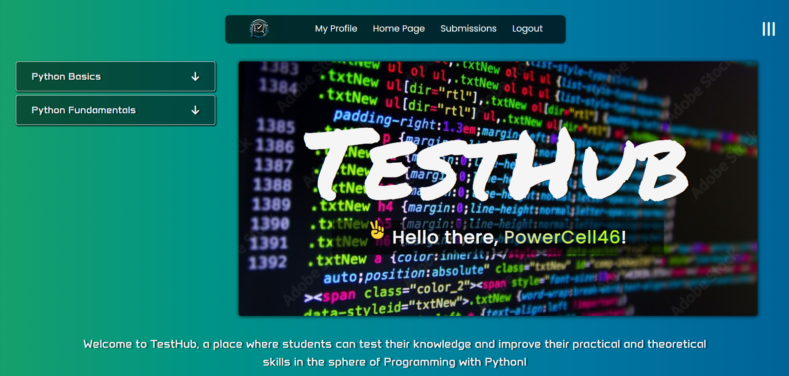
     

   Home Page with closed topics and tasks. Accessible by authenticated and unauthenticated users. If the user is authenticated there's a greeting message in the right container.

       
    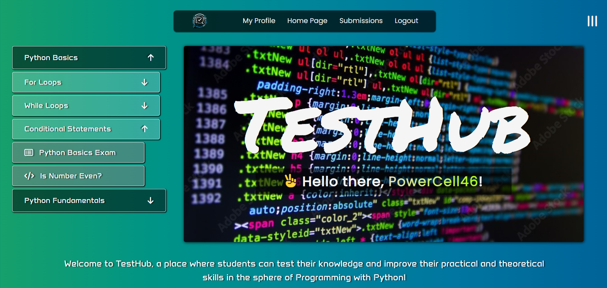
     

   Home Page with opened topics and tasks. Clicking on a specific course a dropdown menu opens with the available topics, the same happens with the topics - clicking on a topic displays all of the available tasks. Unauthenticated users cannot access the tests, they can only see the structure.

##### Project Integration
   Scrolling down the home page we get to the possible integration of the TestHub Project.

    
    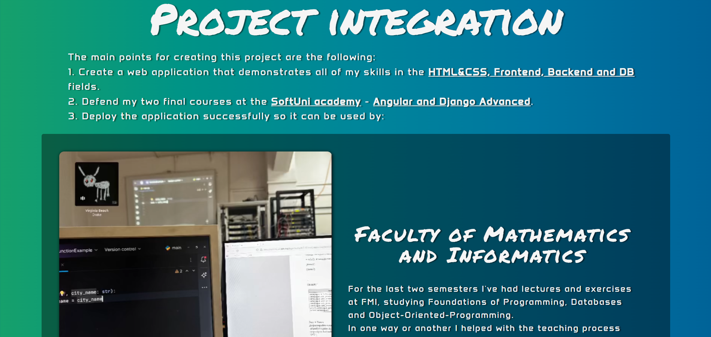
     

   Project Integration - FMI
   

     
    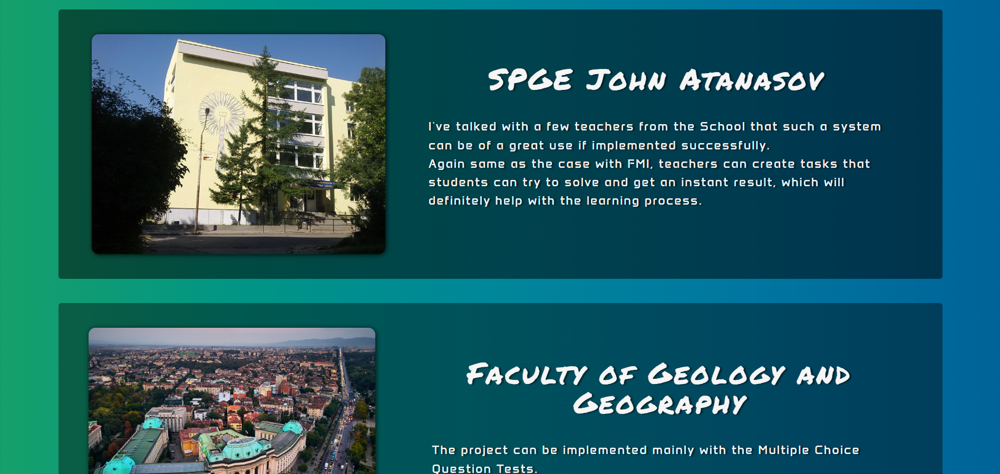
     

   Project Integration - John Atanasov
   

     
    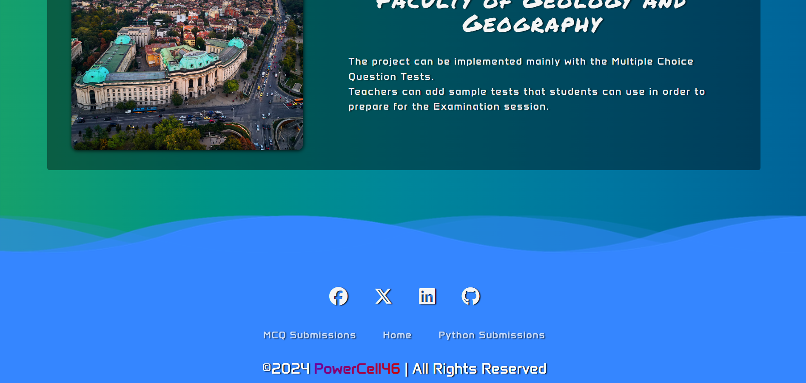
     

   Project Integration - GGF

### Register View

     
    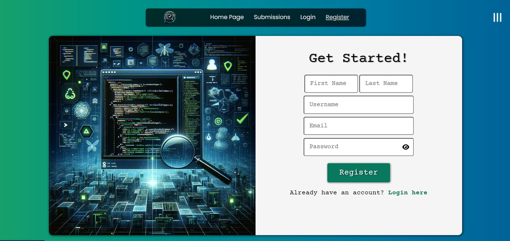
     

   Register View acessible only by unauthenticated users.

### Login View

     
    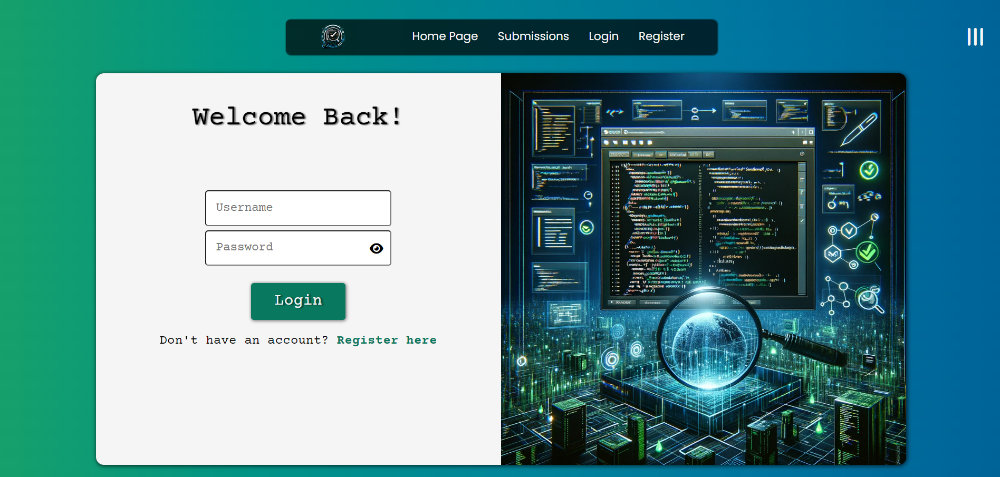
     

   Login View accessible only by unauthenticated users.

### Logout View

     
    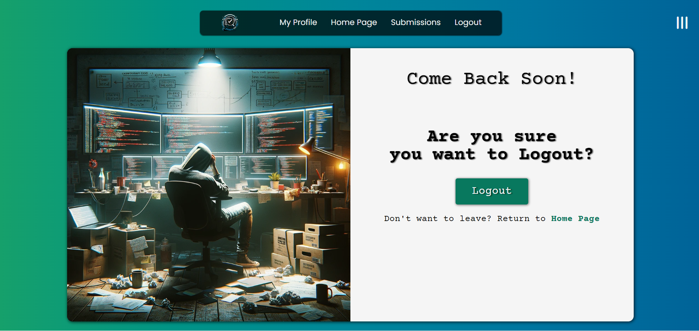
     

   Logout View accessible only by authenticated users.

### Create Python Test

     
    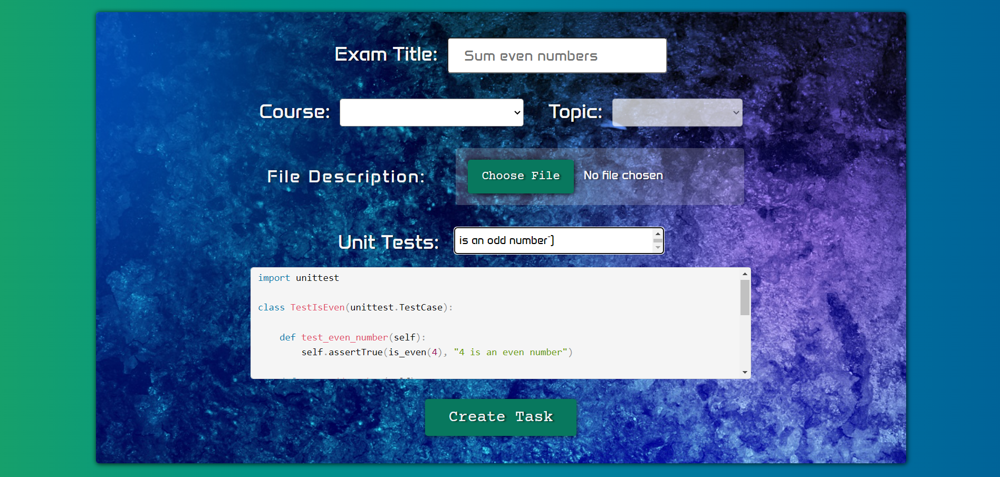
     

   If the logged account is a Teacher, clicking on the Project Logo there's a dropdown menu with available creating options - create Python Test and create MCQ Test. After the Teacher successfully fills in the form a new Python Test is created.

### Create MultipleChoice Test

     
    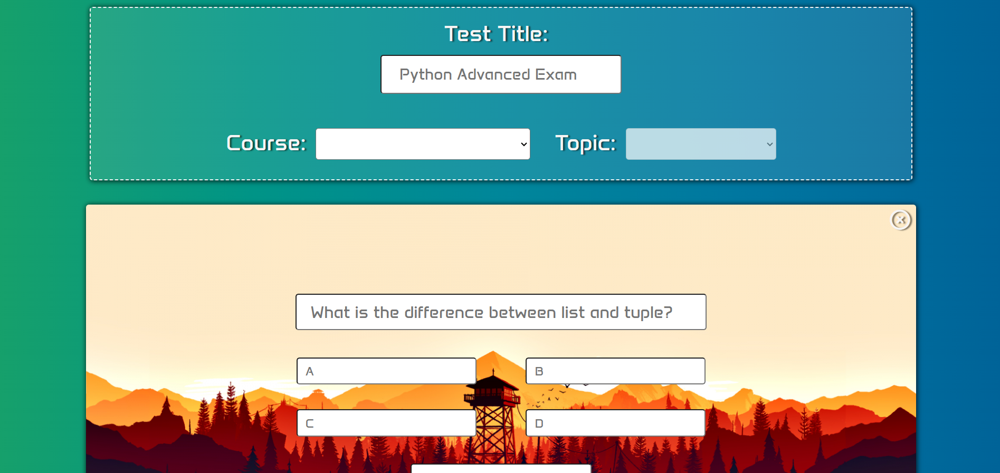
     

   If the logged account is a Teacher, clicking on the Project Logo there's a dropdown menu with available creating options - create Python Test and create MCQ Test. After the Teacher successfully fills in the form a new MultipleChoice Test is created.

### Submit Python Test

     
    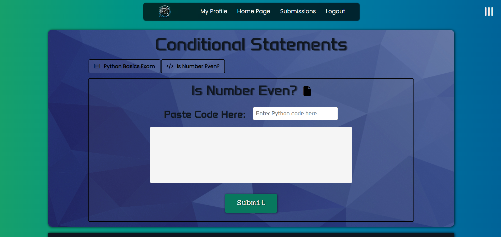
     

   Every authenticated user can select a specific Python Task, read the description file and submit his/hers solution to the problem. After a few seconds the pages refreshes and scrolling down you can see how many points you've got.

     
    
     

   Below the Python Test Submission is a list with the last 5 submissions for this task from the current logged in user.

### Submit MultipleChoice Test

     
    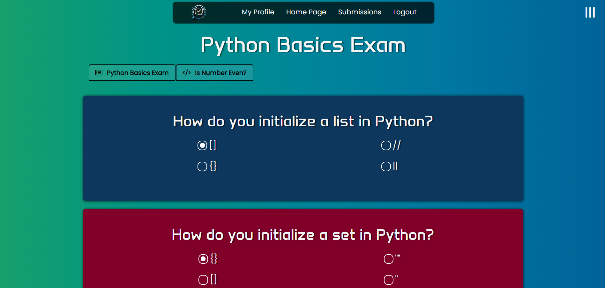
     

   Every authenticated user can select a specific MCQ Test, answer the questions and submit his/hers answers. 

### MultipleChoice Test Results

     
    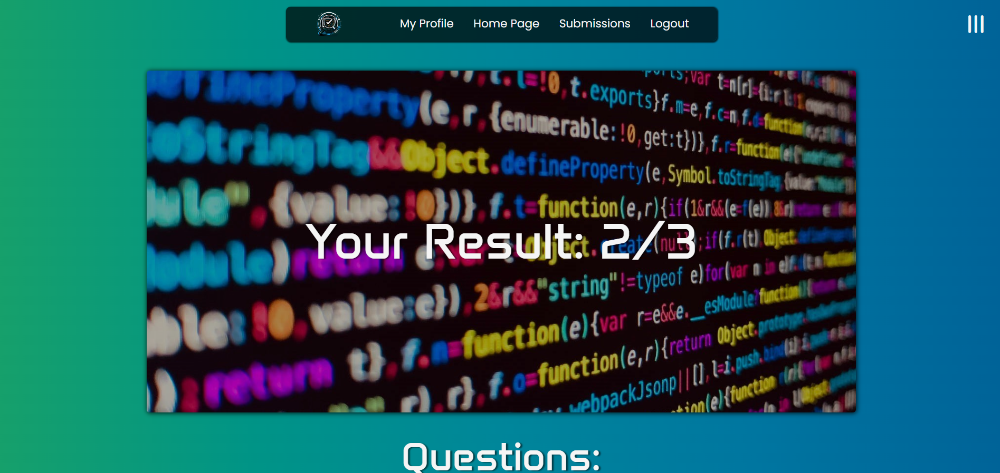
     

   After the user has submitted the Test, he/she is redirected to the Result MCQ Test view, where you can see how many points you've got.

     
    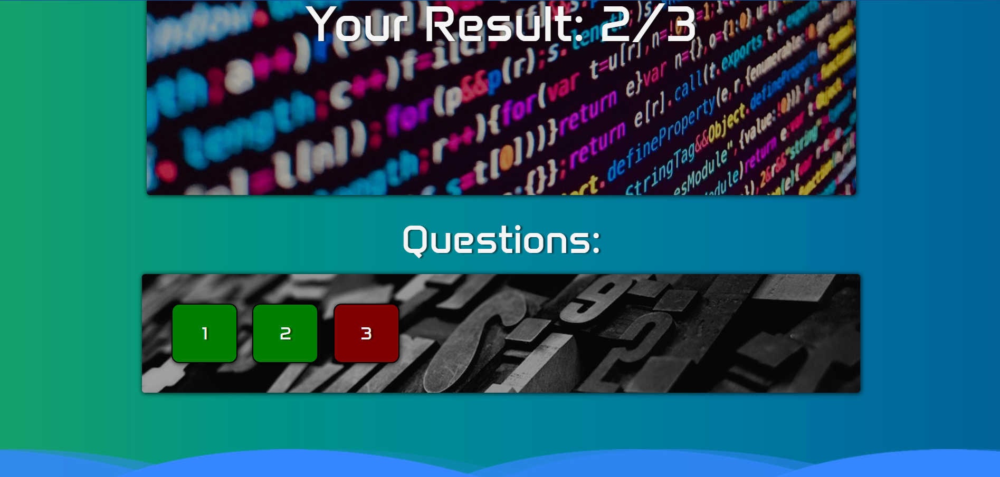
     

   Scrolling down you can see which of the submitted answers are correct and which ones are wrong.

### Single MultipleChoice Question Result

     
    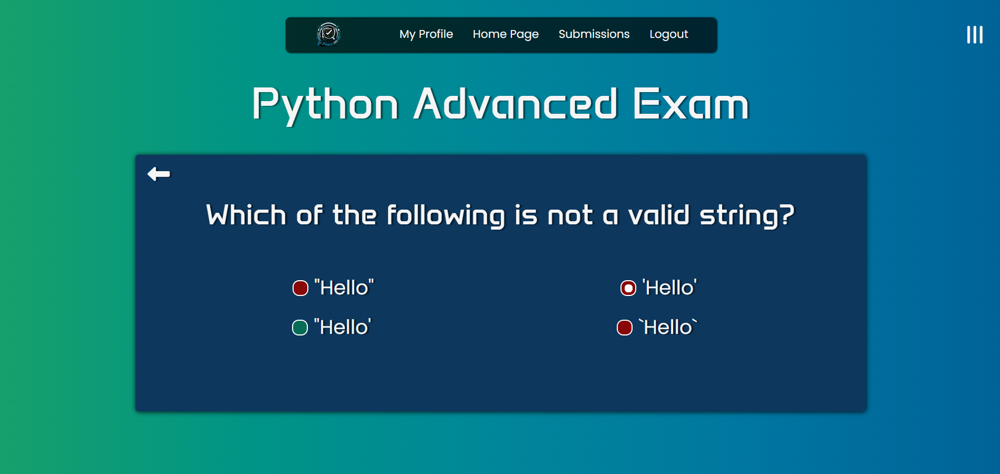
     

   Clicking on a specific question you can see exactly what is the correct answer and which one you have selected, so you can learn from your mistakes.

### Python Submissions

     
    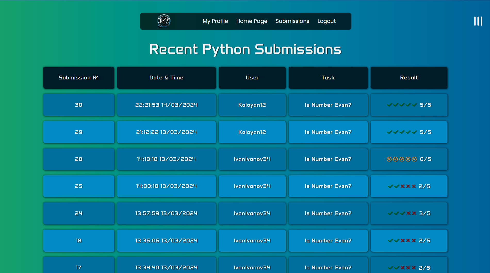
     

   In the header, clicking on the Submissions, a dropdown menu appears where you can choose from Python and MCQ Submissions.
   Here can see the last 10 Python submissions in the platform. 
    

### MultipleChoice Submissions

     
    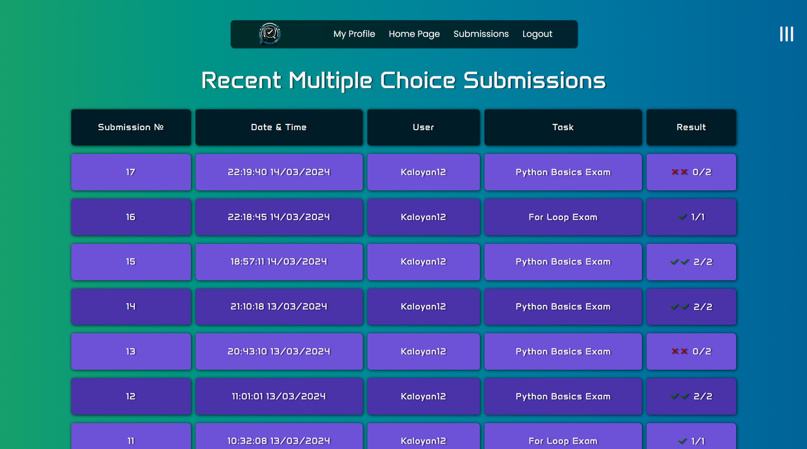
     

   In the header, clicking on the Submissions, a dropdown menu appears where you can choose from Python and MCQ Submissions.
   Here can see the last 10 MCQ submissions in the platform. 

### My Profile

     
    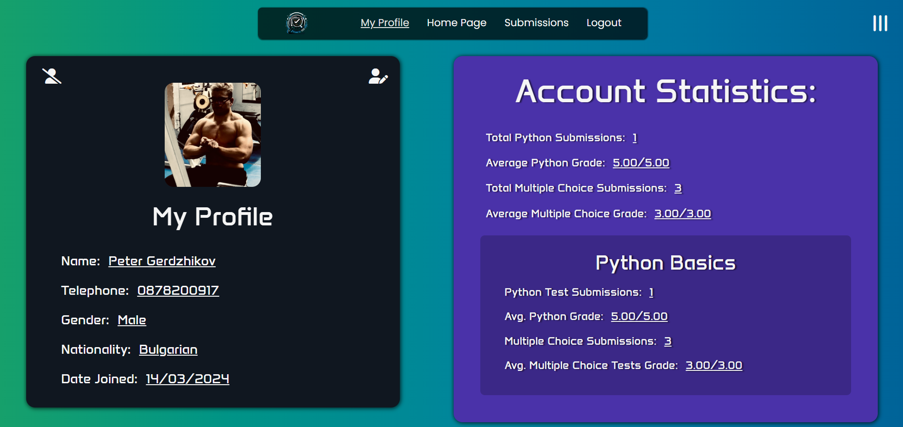
     

   My Profile view, accessible only by authenticated users, where people can see their Personal Data, Total Account Statistics, and Statistics for every course that they have participated in.