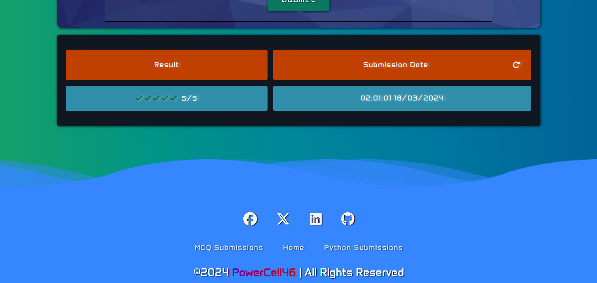

<!-- # Test-Hub
A repository containing my currently developed project, written in Django and Angular.

### Initialize Angular Project: 
- ng new client --no-standalone --routing --ssr=false
- resourse: https://github.com/angular/angular/issues/52751
 -->
# TestHub Documentation

## Introduction:

TestHub is an online system designed to facilitate test creation, management, and participation for educational purposes. It allows teachers to create two types of tests - Multiple-choice tests and Python tests. The system is organized into courses, with each course containing various topics. Within each topic, different tests can be assigned. Students can attempt these tests and receive instant feedback on their performance.

## Features:

- **Test Creation:** Teachers can create multiple-choice tests and Python tests.
- **Course Management:** Courses are organized into topics, allowing for structured learning.
- **Instant Results:** Students receive immediate feedback on their test attempts.
- **User Profiles:** Each user has a personalized profile page displaying personal information and statistics related to their account.

## Technologies Used:

- **Backend:** Django Rest Framework
- **Frontend:** Angular
- **Database:** PostgreSQL
- **Frontend Styling:** Custom HTML and CSS

## Setup Instructions:
   - Make sure that you have **Node.js, Python** installed and configured.
   - Clone the repository.

1. **Setting Up The Frontend:**
   - Use **cd client** to navigate to the Frontend Part of the application. Run **npm install** to download all the needed dependencies. 
   - When the process is done Run **ng serve** to start the Frontend

2. **Setting up the Backend:**
   - Use **cd server** to navigate to the Backend Part of the application. Run **pip install -r requirements.txt** to download all the needed dependencies. 
   - Choose whether to use **Postgre SQL** or **SQL Lite**. 
   If you choose **Postgre SQL** make sure that you have created the database before that.
   - Run **python manage.py migrate** to create all of the tables in the Database.
   - Run **python manage.py createsuperuser** and setup an account for managing the system.
   - Run **python manage.py runserver** to start the Backend.
   - Using the navigation go to **Django Admin** and Authenticate with the created user. After that go to **Authentication and Authorization** section and click on **Groups**. On the right side click on **add group**, name it ***Teachers*** and select the permissions that you want to give to every Teacher. After that is finished click on **Save**.
   Again in the **Authentication and Authorization** section choose users, (select your user for example) and in the groups section give the Teachers role to the user. Don't forget to save.

3. **Starting the Application:**
   - In the console where you started the Frontend/Client, click on the given link to access the Web Application.

## Directory Structure:

- **client:** Contains Angular frontend files.
- **server:** Contains Django backend files.
- **project-images:** Screenshots from the Web Application.

## Usage:

1. **Course&Topic Creation:**
   - The Administrator can create courses and topics through the Django Admin Site.  

2. **Test Creation:**
   - Teachers can log in and create new tests under the desired course and topic.

3. **Test Participation:**
   - Students can log in and attempt tests available under their enrolled courses and topics.

4. **Profile Page:**
   - Users can view their personal information and statistics, including total stats and stats for each course participated in.

# TestHub Documentation

#### Home View

    
     

   Home Page with unopened topics and tasks.
    

    
     

   Home Page with opened topics and tasks.
    

    
     

   Project Integration Part 1
    

    
     

   Project Integration Part 2
    

    
     

   Project Integration Part 3
    

### Register View

    
     

   Register View
    

### Login View

    
     

   Login View
    

### Logout View

    
     

   Logout View
    

### Create Python Test

    
     

   Create Python Test (accessible only by Teachers)
    

### Create Multiplechoice Test

    
     

   Create Multiplechoice Test (accessible only by Teachers)
    

### Submit Python Test

    
     

   Python Test Submit Section
    

    
     

   Python Test Submit previous user submissions
    

### Submit MultipleChoice Test

    
     

   Submit MultipleChoice Test
    

### MultipleChoice Test Results

    
     

   Result MultipleChoice Test 1
    

    
     

   Result MultipleChoice Test 2
    

### Single MultipleChoice Question Result

    
     

   Result Single MultipleChoice Question
    

### Python Submissions

    
     

   Python Submissions
    

### MultipleChoice Submissions

    
     

   MultipleChoice Submissions
    

### My Profile

    
     

   My Profile
    